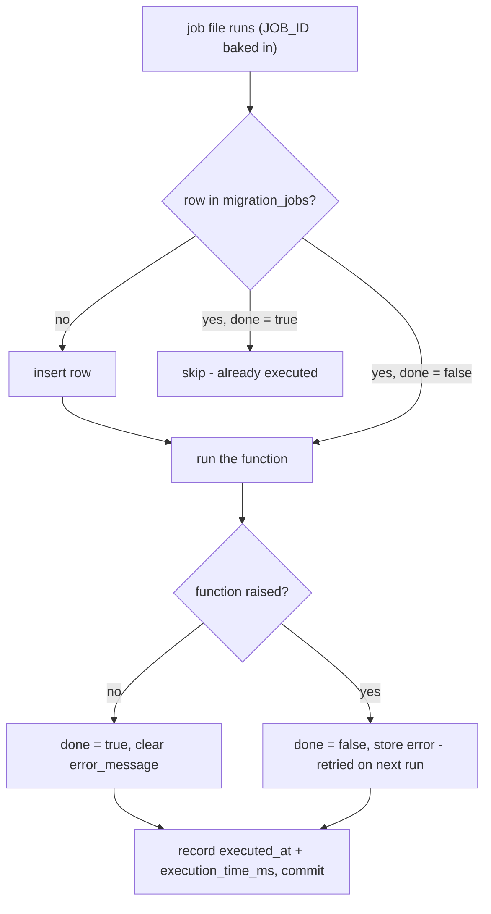

# migration-jobs

A small framework for **run-once application jobs** backed by Postgres.

You generate a Python file per job, plug in the function it should run, and a runner executes every job sequentially while tracking each invocation in a `migration_jobs` table — so the same job never runs twice on success, and failed jobs auto-retry on the next run.

---

## When to use this

Use it for one-off operational work that needs to happen exactly once across environments and that you want to be auditable:

- Backfills (e.g. populate a new column on existing rows)
- Data corrections / cleanups
- Onboarding tasks for new tenants or features
- Migrating data between tables / external systems
- Anything you'd otherwise run as an ad-hoc script and lose track of

**Don't** use it for:

- **Schema changes** — use Alembic (this project uses Alembic for its own `migration_jobs` table).
- **Recurring work** — use a scheduler / cron.
- **Things that need to run on every deploy** — use a regular CI step.

---

## Architecture

```
.
├── alembic/                         # Schema migrations (incl. the migration_jobs table)
├── alembic.ini
├── app_migrations_jobs/             # One file per job (created on first generate). Each is independently executable.
├── database/
│   ├── db_client.py                 # Async engine + AsyncSessionLocal
│   └── models/
│       ├── migration_job.py         # MigrationJob ORM model
│       └── utils.py                 # Base + TimestampMixin
├── generate_migration_job.py        # CLI: creates a new job file
├── run_job_migrations.py            # CLI: runs every job + verifies DB state
└── pyproject.toml
```

### The `migration_jobs` table

| column              | type          | meaning                                                |
| ------------------- | ------------- | ------------------------------------------------------ |
| `id`                | UUID (PK)     | Same UUID baked into the job file. Links file <-> row. |
| `description`       | TEXT          | Free-form description from `-d` flag.                  |
| `done`              | BOOLEAN       | `True` once the job's function returned successfully.  |
| `executed_at`       | TIMESTAMPTZ   | Last time the job ran (success or failure).            |
| `execution_time_ms` | INTEGER       | Wall-clock duration of the last run.                   |
| `error_message`     | TEXT          | `str(exception)` from last failure; cleared on success.|
| `created_at`        | TIMESTAMPTZ   | When the row was first inserted.                       |
| `updated_at`        | TIMESTAMPTZ   | Auto-updated on every change.                          |

This table is the **source of truth** for "did this job run?". The `.py` file is just the script that updates it.

---

## Setup

```bash
# 0. Clone the repository
git clone https://github.com/HabaAndrei/migration-jobs-py.git
cd migration-jobs-py

# 1. Install dependencies
uv sync

# 2. Configure DB credentials (copy .env.example)
cp .env.example .env
# then edit .env with DB_HOST, DB_USER, DB_PASSWORD, DB_NAME, DB_PORT

# 3. Apply Alembic migrations to create the migration_jobs table
uv run alembic upgrade head
```

---

## Workflow

### 1. Create a job

```bash
uv run generate_migration_job.py -d "backfill billing_plan for tenants"
# or
uv run generate_migration_job.py --description="backfill billing_plan for tenants"
```

This writes a new file to `app_migrations_jobs/`, with a fresh UUID baked in:

```python
"""
ID: 'cbbbf13c-1478-4ac9-97c6-0f0477f53807'
DESCRIPTION: 'backfill billing_plan for tenants'
"""

import asyncio, time, uuid
from datetime import datetime, timezone

from database.db_client import AsyncSessionLocal
from database.models.migration_job import MigrationJob

# TODO: replace this with the function you want this job to execute.
# from some.module import the_function_to_run
def the_function_to_run():
    pass


JOB_ID = uuid.UUID('cbbbf13c-1478-4ac9-97c6-0f0477f53807')
DESCRIPTION = 'backfill billing_plan for tenants'


async def run():
    async with AsyncSessionLocal() as session:
        job = await session.get(MigrationJob, JOB_ID)

        if job is not None and job.done:
            print(f"Job {JOB_ID} already done, skipping.")
            return

        if job is None:
            job = MigrationJob(id=JOB_ID, description=DESCRIPTION)
            session.add(job)
            await session.commit()

        start = time.perf_counter()
        try:
            result = the_function_to_run()
            if asyncio.iscoroutine(result):
                await result
            job.done = True
            job.error_message = None
        except Exception as e:
            job.done = False
            job.error_message = str(e)
        finally:
            job.executed_at = datetime.now(timezone.utc)
            job.execution_time_ms = int((time.perf_counter() - start) * 1000)
            await session.commit()


if __name__ == "__main__":
    asyncio.run(run())
```

### 2. Plug in your function

You **only edit one thing**: replace `the_function_to_run` with the real function. It can be **sync or async** — the runner detects coroutines automatically.

**Pattern A — import an existing function:**

```python
from app.services.billing import recompute_plan_for_all_tenants as the_function_to_run
```

**Pattern B — async function:**

```python
from app.services.search import reindex_all_documents as the_function_to_run
# reindex_all_documents is `async def` -- the runner will await it.
```

**Pattern C — write the logic inline:**

```python
async def the_function_to_run():
    async with AsyncSessionLocal() as s:
        await s.execute(
            "UPDATE users SET billing_plan = 'starter' WHERE billing_plan IS NULL"
        )
        await s.commit()
```

### 3. Run jobs

**Run a single job (dev / debugging):**

```bash
uv run app_migrations_jobs/<file>.py
```

**Run every job in the folder + verify (typical CI / deploy use):**

```bash
uv run run_job_migrations.py
```

**Just verify state, don't execute:**

```bash
uv run run_job_migrations.py --verify
```

### Sample output

```
Found 2 job file(s). Running step by step...

--- 1b151a04-...succeeds.py ---
  ok
--- cbbbf13c-...fails.py ---
  ok

=== verification (DB state) ===

MigrationJob rows: 2  (done: 1, pending: 1, with error: 1)

id                                     done   ms       description / error
----------------------------------------------------------------------------
1b151a04-35a5-4bb4-9b21-5940610bc658   True   120      demo job that succeeds
cbbbf13c-1478-4ac9-97c6-0f0477f53807   False  3        demo job that fails  | error: intentional failure for testing
```

---

## How "run-once" works

Each job file embeds its own UUID. On run, it:

1. Looks up `MigrationJob` by that UUID (`session.get(MigrationJob, JOB_ID)`).
2. If row exists and `done=True` -> **skips**, returns immediately.
3. If row missing -> inserts a new row, then runs.
4. If row exists with `done=False` -> reuses it, retries.
5. After running, updates `done`, `error_message`, `executed_at`, `execution_time_ms`. Commits.



So:

| State on disk + DB                 | What `run()` does                                  |
| ---------------------------------- | -------------------------------------------------- |
| File exists, no DB row             | Insert row, run function, commit result.           |
| File + row, `done=True`            | Print "already done, skipping". No re-execution.   |
| File + row, `done=False` + error   | Retry function. On success, clear `error_message`. |

---

## Integrating with CI / deploy

A typical deploy hook:

```bash
uv run alembic upgrade head             # 1. schema migrations
uv run run_job_migrations.py            # 2. application-level jobs
```

> **Note:** `run_job_migrations.py` exits 0 even if individual jobs fail (failures are recorded in the DB). If you want CI to fail when any job fails, query the DB after the run for `done=False` rows, or modify `run_all_jobs()` to track failures and return a non-zero exit code.

---

## Production considerations

This framework is built for the typical "run as a one-off step on deploy" pattern. A few real things to know before relying on it heavily:

- **Execution order is alphabetical by filename** — and filenames start with a random UUID, so order is effectively random. Fine if jobs are independent (the usual case). If job B depends on job A, manually rename files with a numeric or timestamp prefix, e.g. `001_<uuid>...py`, `002_<uuid>...py`.

- **No concurrency protection** — two parallel runs against the same DB can race on the initial insert; one will hit a primary-key conflict. Safe for single deploy hooks. If you fan out across multiple workers, add a row-level lock or a `SELECT ... FOR UPDATE` around the insert.

- **Failures don't stop the runner** — if a job's `run()` raises, the runner logs it and moves on. The job's row is left with `done=False` so the next invocation retries it. This is intentional, but if you need fail-fast behavior, change `run_all_jobs()` to break on the first exception.

- **Description sanitization is minimal** — avoid `/`, newlines, or `"""` in descriptions. They'll either break filename creation or produce malformed Python in the generated file. ASCII text without quotes is always safe.

- **Connection pool is not explicitly disposed** — the engine in `database/db_client.py` is module-scoped and torn down by the OS at process exit. Fine for short-lived CLIs.

- **Re-running a successful job requires resetting the row** — because the dedup is keyed on `done=True`. To force a re-run:

  ```sql
  UPDATE migration_jobs SET done = false WHERE id = '...';
  ```

  or delete the row entirely.

---

## License

[MIT](LICENSE)
